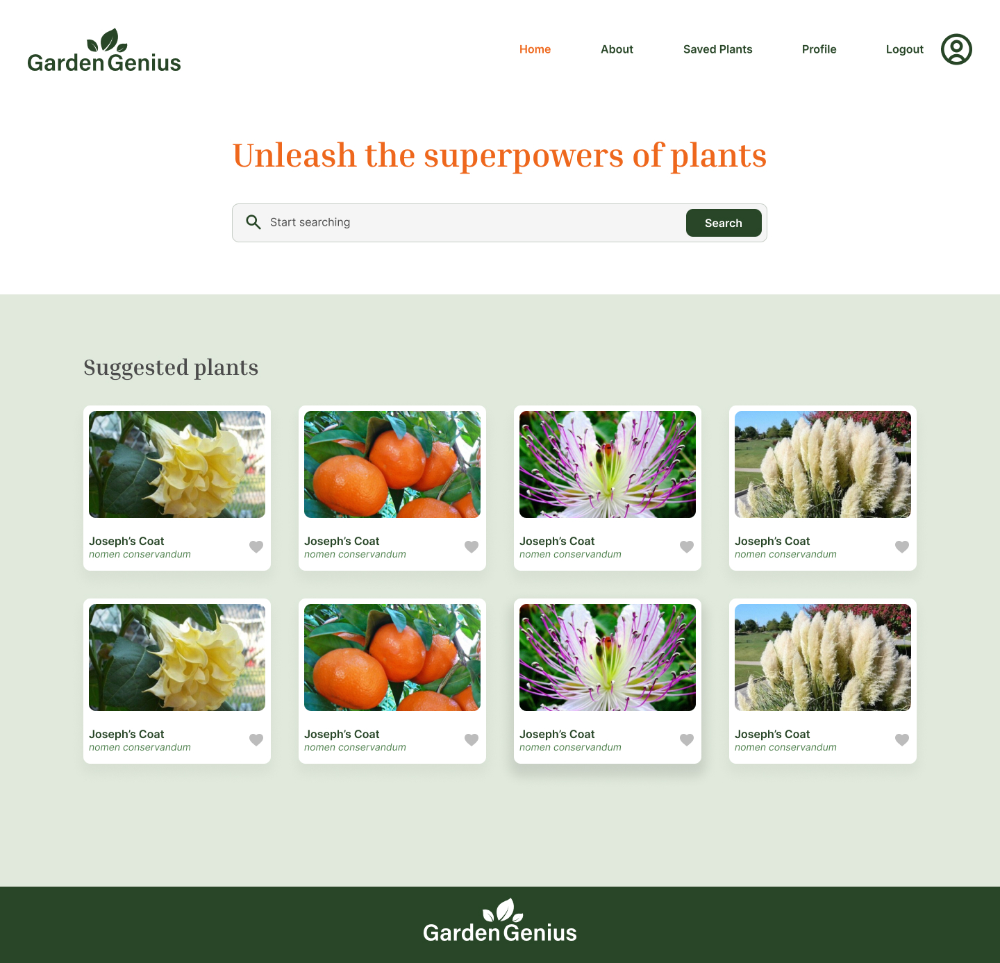

# GardenGenius

GardenGenius is een webapplicatie waarmee gebruikers hun favoriete planten kunnen opslaan en beheren. Gebruikers kunnen inloggen, planten liken en hun opgeslagen planten bekijken. De applicatie maakt gebruik van de API van NOVI voor authenticatie en de API van Perenual voor plantgegevens.

https://github.com/jasin1/novi-eindopdracht-gardenGenius

## Benodigdheden

Om deze applicatie te kunnen runnen, heb je het volgende nodig:

- Node.js (versie 14 of hoger)
- npm (versie 6 of hoger)
- Een API key van [Perenual.com](https://perenual.com/docs/api) 
- Een werkende backend die de gebruikersauthenticatie beheert 

## Installatie-instructies

Volg de onderstaande stappen om de applicatie lokaal op je machine te installeren en te runnen:

1. **Clone de repository:**
   ```bash
   git clone https://github.com/jouw-gebruikersnaam/gardengenius.git
   cd gardengenius

2. Installeer de benodigde dependencies:
Zorg ervoor dat je Node.js en npm geïnstalleerd hebt. Daarna kun je de dependencies installeren met:

   npm install

   


3. Start de development server:
   npm run dev

De applicatie zou nu toegankelijk moeten zijn via http://localhost:3000.



## Inloggegevens
Gebruik de volgende inloggegevens om toegang te krijgen tot de applicatie:

- Gebruikersnaam: Jasin
- Email: jasin.tairaidrissi@gmail.com
- Wachtwoord: gardengenius1!
- API key: **sk-nmqA66236192cd6f53490**

### Toelichting 
De installatiehandleiding bevat alle noodzakelijke informatie die een ontwikkelaar nodig heeft om de applicatie lokaal te installeren en te runnen. Het begint met een overzicht van de functionaliteit en een screenshot van de applicatie. Vervolgens geeft het een lijst van benodigdheden, gedetailleerde installatie-instructies en inloggegevens voor testaccounts. Deze handleiding zorgt ervoor dat zelfs een ontwikkelaar zonder ervaring binnen het frontend-landschap de applicatie succesvol kan opzetten en gebruiken.


